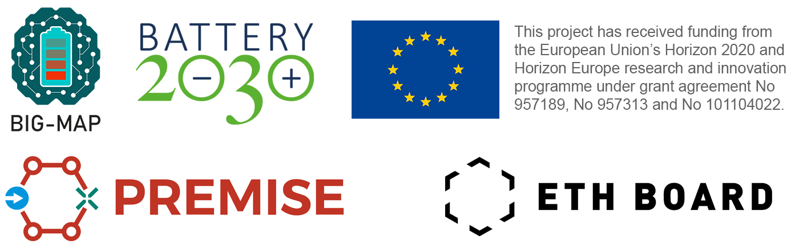

[](https://pypi.org/project/battinfoconverter-backend/)
[](https://github.com/empaeconversion/battinfoconverter/blob/main/LICENSE)
[](https://pypi.org/project/battinfoconverter/)
[](https://github.com/empaeconversion/battinfoconverter/actions/workflows/pytest.yml)
[](https://app.codecov.io/gh/empaeconversion/battinfoconverter)


**BattINFO Converter** is a Python-based web application that simplifies the semantic annotation of battery metadata. It converts coin cell battery metadata from an Excel-based schema into a **JSON-LD** format using the [BattINFO ontology](https://github.com/BIG-MAP/BattINFO), ensuring standardized and machine-readable metadata. This tool is designed for non-technical users, eliminating the need for manual JSON-LD creation. Researchers only need to fill in an Excel template, and the converter automates the transformation process, enhancing data interoperability, reproducibility, and [FAIRness](https://www.go-fair.org/fair-principles/). By adopting **BattINFO Converter**, research groups can ensure that their battery metadata is structured, shareable, and reusable, facilitating better collaboration and advancing battery research.

🔗 Visit **[BattINFO converter](https://battinfoconverter.streamlit.app/)** to use the app.

## Python package

The backend that powers the web application is available as a Python package, which can be used for batch/automation tasks or reused in other projects. Install with:

```bash
pip install battinfoconverter-backend
```

Use the XLSX → JSON-LD conversion with:

```python
from battinfoconverter_backend import convert_excel_to_jsonld

result = convert_excel_to_jsonld("example.xlsx")
```

If you want to run the streamlit app locally, clone the repo and use `streamlit run`. For example, with `uv`:
```bash
git clone https://github.com/empaeconversion/battinfoconverter  # Clone the repo
cd battinfoconverter  # Go into the cloned folder
uv sync --extras=app # Install battinfoconverter with app dependencies
uv run streamlit run ./battinfo_app/BattInfo_converter.py  # Run the app
```

## Citation

Nukorn Plainpan, Simon Clark, and Corsin Battaglia. "BattINFO Converter: An Automated Tool for Semantic Annotation of Battery Cell Metadata." *Batteries & Supercaps* (**2025**): 2500151. [doi.org/10.1002/batt.202500151](https://doi.org/10.1002/batt.202500151)


## Acknowledgements

The BattINFO converter web application was developed by Dr. Nukorn Plainpan, Dr. Graham Kimbell, and Prof. Dr. Corsin Battaglia at [Empa](https://www.empa.ch/), the Swiss Federal Laboratories for Materials Science and Technology in the Laboratory [Materials for Energy Conversion](https://www.empa.ch/web/s501). We acknowledge stimulating discussions and support from Dr. Simon Clark, SINTEF.

The development of BattINFO converter was supported by funding for the [Battery2030+](https://battery2030.eu/) initiative from the European Union’s research and innovation program under grant agreement No. 957213 and No. 101104022 and from the Swiss State Secretariat for Education, Research, and Innovation (SERI) under contract No. 2300313 as well as funding for the [PREMISE](https://ord-premise.org/) project from the open research data program of the ETH Board.


